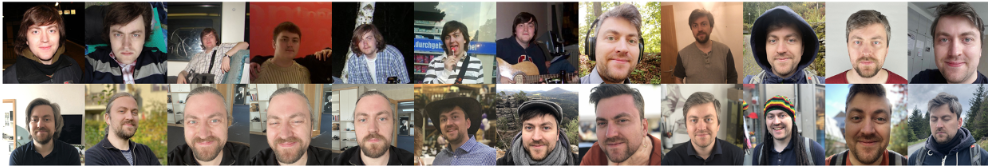
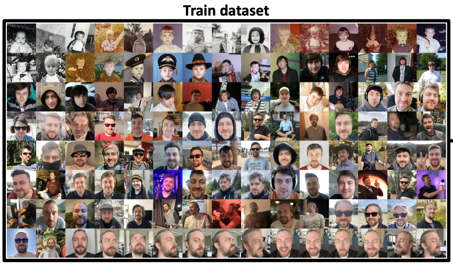
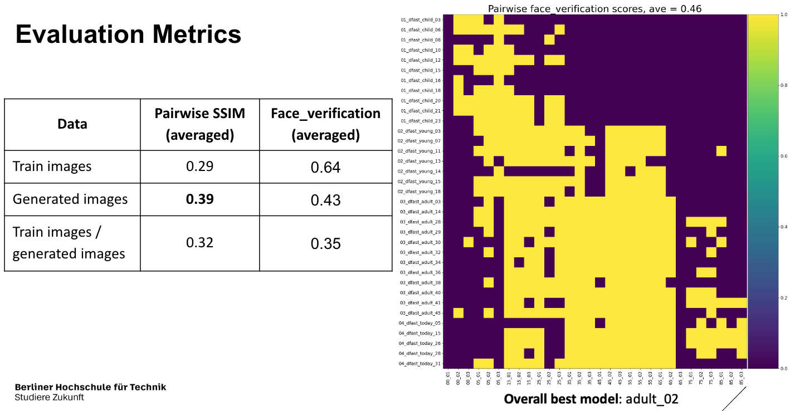
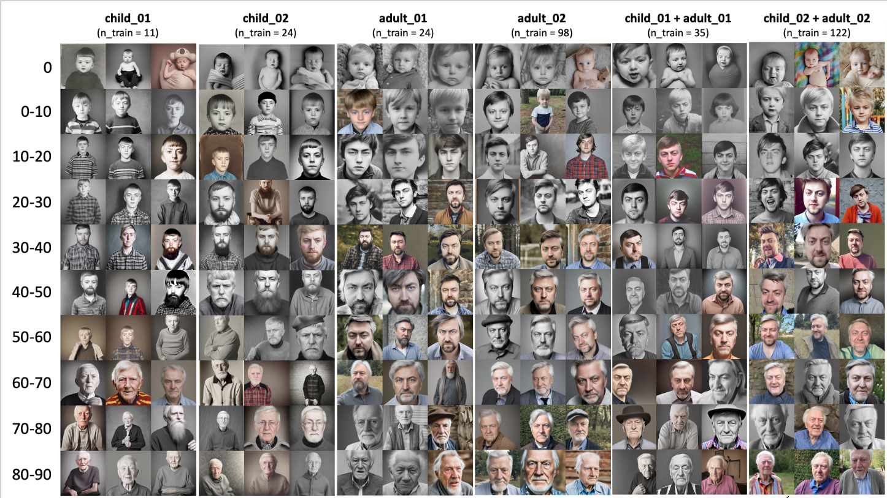
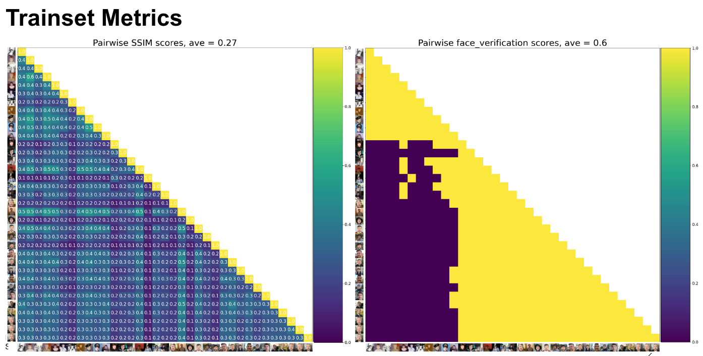
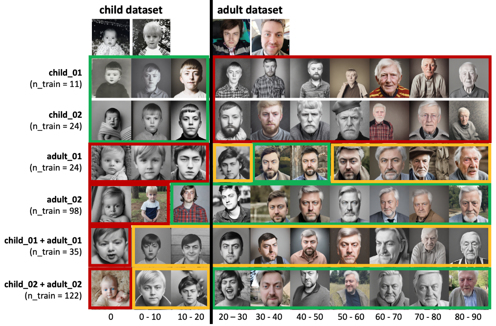

# Group project for Learning from Images course @ BHT, Data Science Master Program, WS22/23

# Application of advanced StableDiffusion techniques

## About Stable Diffusion model in general
Stable Diffusion is a deep learning, text-to-image model released in 2022. It is primarily used to generate detailed images conditioned on text descriptions, though it can also be applied to other tasks such as inpainting, outpainting, and generating image-to-image translations guided by a text prompt. Stable Diffusion uses a variant of diffusion model (DM), called latent diffusion model (LDM). Stable Diffusion was trained on pairs of images and captions taken from LAION-5B, a publicly available dataset derived from Common Crawl data scraped from the web, where 5 billion image-text pairs were classified based on language, filtered into separate datasets by resolution, a predicted likelihood of containing a watermark, and predicted "aesthetic" score (e.g. subjective visual quality).


## Application of Stable Diffusion

### Prompt-to-Prompt (Amin Suaad)
**Short description**: Editing a generated image is challenging. Often, small changes in prompt makes a huge change in the image and this localized editing or controlled editing is a problem in situations. Prompt-to-Prompt technique is a solution is such cases. Here, Cross attention layers are key to establish the relation between the image and each word of the prompt. Prompt-to-prompt allows text level control. Some examples of Prompt-to-prompt technique:

- Localized editing by replacing a word,
- Global editing by adding a specification,
- Controlling the extent to which a word is reflected in the image

I've used prompt-to-prompt technique in specific situations where it makes more sense to have a text level control in editing.

**Used data**: Set of prompts

**Implementation**: TBD

**Evaluation metrics**: SSIM score was used to evalutate the similiraty of the generate images

**Sources**:
- https://github.com/google/prompt-to-prompt,
- https://prompt-to-prompt.github.io/ptp_files/Prompt-to-Prompt_preprint.pdf 


### DreamBooth (Dennis Fast)
**Short description**: Fine-tuning a model using DreamBooth technique enables generation of different images of the a subject instance in different environments, with high preservation of subject details and realistic interaction between the scene and the subject. For my part of the project, I used the DreamBooth technique to fine-tune Stable Diffusion model in order to create a digital avatar of myself and put it to different scenes using text prompts. I analysed the abilities of the fine-tuned models to generate images of digital avatar at different ages.

**Used data**: The input data are the images of myself in diverse clothes, in various poses, at different ages and in wide-ranging enviroments. In order to improve the quality of the synthesized images, the input images should have the greatest possible variation so that the model learns only the features of the person and not particular clothes or environment. The inital dataset contained 122 face images.

**Implementation**:

- The code to generate images with Stable Diffusion 1.5 using DreamBooth can be found [here](https://colab.research.google.com/github/ShivamShrirao/diffusers/blob/main/examples/dreambooth/DreamBooth_Stable_Diffusion.ipynb) (Google Colab)
- The code for the preprocessing and evalutation steps can be found [here](DreamBooth/evaluation.ipynb)

In order to generate new images and to evaluate the results, I had to preprocess the dataset first. Therefore, I used SSIM metric to assess the pairwise structual dissimilarity of the training set. The averaged score over all possible combinations should be as low as possible in to ensure the highest variation among the dataset.

At the same time, I wanted to find a measure, which would classify all the train images as the same person. For this, I used [DeepFace](https://github.com/serengil/deepface) library and more specifally, its **verify** function, which detect faces at both images and compare them using cosine similarity score. I tested all the possible methods impelemented in the library and, in my case, **VGG-Face** worked the best. Therefore, I kept using this method in all the later evalutation steps.

Using these two metrics, I was able to filter out the images where no face could be detected and split images into two allmost distinct subsets: child (11 images) and adult (24 images).

So, I ended up with six different datasets for the models:
- child_01: child images where a face was detected and veryfied as the same person (11 images),
- child_02: all child images (24 images),
- adult_01: adult images where a face was detected and veryfied as the same person (24 images),
- adult_02: all adult images (98 images),
- all_01: all images where a face was detected independent from the age (child_01+adult_01, 35 images),
- all_02: all available images (child_02+adult_02, 122 images)

After the preprocessing step, the images were generated with DreamBooth using Stable Diffusion 1.5.

For the evaluation, I generated 3 images for 10 different ages (newborn, 0-10 years old, 10-20 years old, ...). You can find the age prompt and the general prompt for creating images below.

```python
age_prompt = ['a newborn baby','a five years old child',
           'a fifteen years old teenager',
           'a young man in his twenties',
           'an adult man in his thirties',
           'an exhausted adult man in his fourties with grayish hair',
           'an wrinkled adult man in his fifties with gray hair',
           'an wrinkled senior in his sixties',
           'an 75 years old old senior in his seventies',
           'a elderly senior in his eighties',
           ]

prompt = f'A coloful photo of {model} as {age_prompt}, expressive face, highly detailed, sharp focus, natural bright light'
```

After the images were generated, I applied the same metrics as for the train data to assess the quality of the generated images and to compare the generative models with each other. The best performed model in terms of generating the images at different ages were adult_02 and all_02, which both had the highest variation of the train images.









**Evaluation metrics**:
- SSIM score to evalutate the variation of the images
- verification score (binary classification using VGG-Face from DeepFace) to evaluate the similarity

**Sources**: 
- https://arxiv.org/pdf/2208.12242.pdf,
- https://dreambooth.github.io/


### Textual Inversion (Manuel Freistein)
**Short description**: How good is textual inversion trained Stable Diffusion 2 at generating new realistic Cézanne landscape paintings? Does a fine-tuned Convolutional Neural Network classify their style as Original, Replica, Stable Diffusion image w/o textual inversion, or General Impressionist Landscape Painting?

**Used data**: The dataset to fine-tune the CNN consists of a range of landscape paintings similar in style to that of Paul Cézanne. The photographs of the images are unfortunately not consistent in quality and were taken from a range of different sources. The images were curated and divided into 5 categories from most (0) to least similar (4) in style.

**Implementation**: The code to generate images with Stable Diffusion 1.5 can be found [here](Textual_Inversion_Metric/StableDiffusion1.5_image_generator.ipynb).

- 0 - authentic Cézanne landscape paintings - 89 images
- 1 - hand-painted replicas and forgeries of authentic Cézanne landscape paintings - 68 images
- 2 - Stable Diffusion 1.5 generated Cézanne landscape paintings with guidance scale 8 (w/o textual inversion) - 88 images
- 3 - Stable Diffusion 1.5 generated Cézanne landscape paintings with guidance scale 0-1 (w/o textual inversion) - 93 images
- 4 - Impressionist landscape paintings from WikiArt dataset - 94 images

Textual Inversion was not implemented when creating the dataset. A separate test dataset with Textual Inversion generated Cézanne landscape paintings was created [here](Textual_Inversion_Metric/StableDiffusion2_textual_inversion_image_generator.ipynb).

The code for Textual Inversion training of Stable Diffusion can be found [here](Textual_Inversion_Metric/StableDiffusion2_textual_inversion_training.ipynb)

- TISD1 - images created by Stable Diffusion 2 with textual inversion trained prompt: "painting in the style of <Cézanne>"
- TISD2 - images created by Stable Diffusion 2 with textual inversion trained prompt: "landscape painting in the style of <Cézanne>"
- TISD3 - images created by Stable Diffusion 2 with textual inversion trained prompt: "painting of the Provence in the style of <Cézanne>"
- TISD4 - images created by Stable Diffusion 2 with textual inversion trained prompt: "painting of Mont Saint Victoire in the style of <Cézanne>"

Before training the CNN, the images were all resized to (512, 512, 3). This was done to disabuse the CNN of learning image sizes. Furthermore, the images were all converted to grayscale. This was done to disabuse the CNN of learning color schemes, as color is difficult to grasp consistently for cameras and depends on lighting etc.. The code for data preparation can be found [here](Textual_Inversion_Metric/Data%20Cleaning.ipynb).

**Evaluation metrics**: Three different fine-tuned Convolutional Neural Network models were employed to judge the quality of the textual inversion generated images: [MobileNet](Textual_Inversion_Metric/Cezanne_MobileNet.ipynb), [EfficinetNetB7](Textual_Inversion_Metric/Cezanne_efficientnetb7.ipynb) and [EfficientNetV2L](Textual_Inversion_Metric/Cezanne_efficientnetv2l.ipynb). All were trained using the Keras libary.
   
**Sources**:
- https://arxiv.org/abs/2208.01618
- https://huggingface.co/docs/diffusers/training/text_inversion
- https://gitlab.com/juliensimon/huggingface-demos/-/blob/main/food102/Stable%20diffusion%20example.ipynb
- https://towardsdatascience.com/deep-image-quality-assessment-30ad71641fac
- https://www.sciencedirect.com/science/article/abs/pii/S0957417418304421


## Presentation
- Presentation on the project idea held on 28th of November 2023: [Project Idea](docs/LFI_presentation_intro.pdf)
- Final Presentation held on 6th of Febraury 2023: [Final](docs/LFI_presentation_final.pdf)
